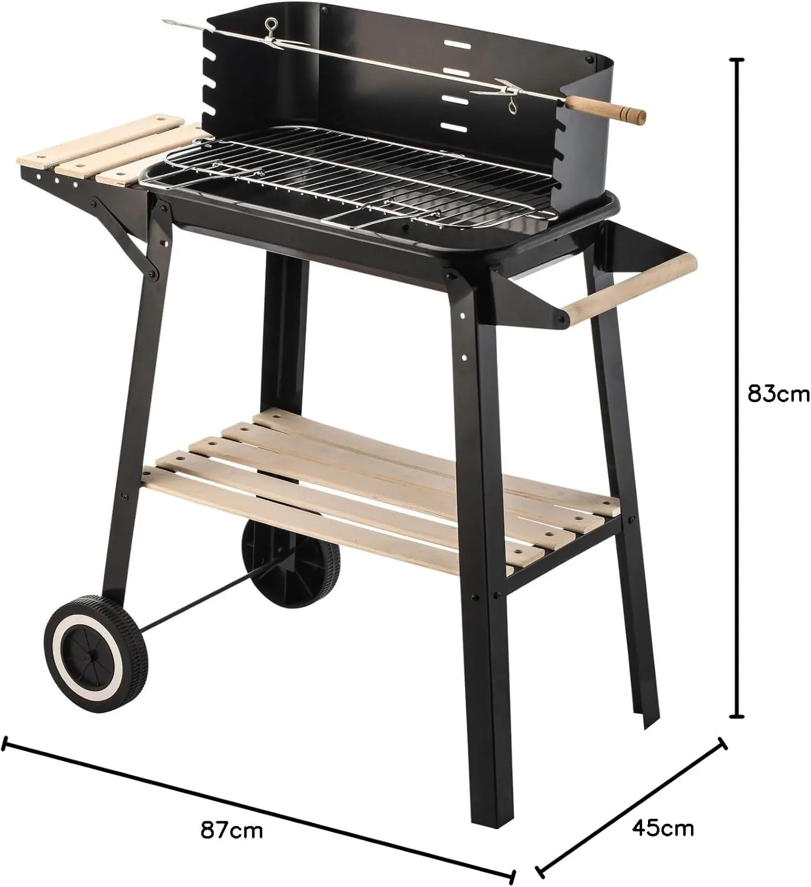

# Weber Family Q BBQ Spit Conversion

## Background

Someone moving house gave me their old [Weber Family Q](https://www.weber.com/AU/en/q-range/family-q-plus/family-q-3200-lp/weber-family-q-titanium-q3200-lp/57062124.html) which was an AUD$700 (USD$450) BBQ for free.

It had no gas and I didn't attempt to use it for months.

However, I eventually took a look at it and realised it could be a good basis for a rotisserie spit.

This is because it has a good set of gas distribution pipes to provide a nice even heat over a wide area.

## Concept

To make a rotisserie you basically need a motor, some way to couple the motor to the food, and a power source. Ideally you also have some fairly good rigid supports on either side of the BBQ and some way to raise and lower it.

You can buy an [official rotisserie kit](https://www.weber.com/AU/en/accessories/accessories-by-barbecue-type/q-accessories/family-q-300-to-3200-series/family-q-rotisserie/17582.html) for $259 but that strikes me as ridiculous.

I found out that you can buy rotisserie parts for indoor ovens but they are usually 28cm long which is not long enough.

For the Weber Family Q you need about 60cm width.

I found [this entire BBQ](https://www.amazon.com.au/gp/product/B0CH1PTP2G) for $50 so bought that instead. It comes with a 60cm skewer, side supports, and an entire new BBQ table (which I can probably reuse for serving or something).

So that takes care of the base skewer, the rigid supports, and the raising and lowering.

The next thing required is a motor and a power source.

I had [one of these motors]() lying around and a [variable speed switch]().

Furthermore, I have some [Makita-compatible batteries]() and a [Makita battery mounting kit]().

## Bill of materials (BOM)

 * 1 x motor (I used )
 * 1 x power source (I used  and )
 * 1 x spit (I used )
 * 1 x height adjustment mounting system (I used )
 * 1 x motion coupler (I used )

Total cost: $50 (instead of $250)

## Result

... to be photographed
