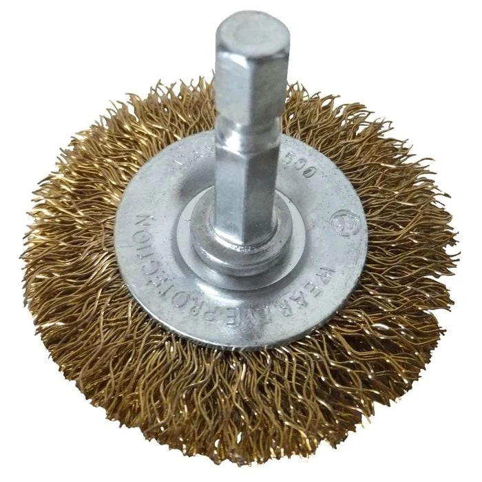

# Weber Family Q BBQ Spit Conversion

## Background

Someone moving house gave me their old [Weber Family Q](https://www.weber.com/AU/en/q-range/family-q-plus/family-q-3200-lp/weber-family-q-titanium-q3200-lp/57062124.html) which was an AUD$700 (USD$450) BBQ for free.

It had no gas and I didn't attempt to use it for months.

However, I eventually took a look at it and realised it could be a good basis for a rotisserie spit.

This is because it has a good set of gas distribution pipes to provide a nice even heat over a wide area.

## Concept

To make a rotisserie you basically need a motor, some way to couple the motor to the food, and a power source. Ideally you also have some fairly good rigid supports on either side of the BBQ and some way to raise and lower it.

You can buy an [official rotisserie kit](https://www.weber.com/AU/en/accessories/accessories-by-barbecue-type/q-accessories/family-q-300-to-3200-series/family-q-rotisserie/17582.html) for $259 but that strikes me as ridiculous.

I found out that you can buy rotisserie parts for indoor ovens but they are usually 28cm long which is not long enough.

For the Weber Family Q you need about 60cm width.

I found [this entire BBQ](https://www.amazon.com.au/gp/product/B0CH1PTP2G) for $50 so bought that instead. It comes with a 60cm skewer, side supports, and an entire new BBQ table (which I can probably reuse for serving or something).

So that takes care of the base skewer, the rigid supports, and the raising and lowering.

The next thing required is a motor and a power source.

I had [one of these motors](https://www.amazon.com.au/dp/B0B21YW465) (AUD$27 = USD$17) lying around and a [variable speed DC PWM controller switch](https://www.aliexpress.com/w/wholesale-dc-pwm.html) (AUD$12 = USD$8).

Furthermore, I have some Makita-compatible batteries and a [Makita battery mounting kit](https://www.ebay.com.au/itm/404556074659) (AUD$15 = USD$9.50).

## Bill of materials (BOM)

 * 1 x motor (I used [this one which came with a mounting L-bracket](https://www.amazon.com.au/dp/B0B21YW465)) (AUD$27 = USD$17)
 * 1 x DC PWM controller (I used one I had lying around) (AUD$15 = USD$9.50)
 * 1 x power source (I used Makita-compatible batteries and a [Makita battery mounting kit](https://www.ebay.com.au/itm/404556074659) (AUD$15 = USD$9.50)
 * 1 x spit (I used part of [this BBQ kit](https://www.amazon.com.au/gp/product/B0CH1PTP2G)) (AUD$50 = $31.67)
 * 1 x height adjustment mounting system (I used part of [this BBQ kit](https://www.amazon.com.au/gp/product/B0CH1PTP2G)) (same unit as above - no cost)
 * 1 x motion coupler (I used one I had laying around, [something like the 10mm to 8mm here](https://www.amazon.com.au/uxcell-Coupling-25mmx40mm-Coupler-Aluminum/dp/B09BZ915X5)) ($5 nominal)

Total cost to me: AUD$92 (instead of $250)

This beats paying $700 + $350 = $1050 retail.

## Pre-assembly

I had to clean the BBQ first. This was achieved using a wire brush attachment for an electric drill, similar to [this one](https://www.bunnings.com.au/josco-100mm-wheel-wire-brush_p6318427).

The process was basically to ensure there was no rust or gunk attached to the two halves of the grill.

In some areas, the external enamel had been damaged and removed and the grill had rusted. The rust was removed.

When the cleaning was finished (both sides of each half of the grill) then it was hosed down with a high pressure hose nozzle to remove dust.

Finally the exposed metal was treated with canola oil for seasoning to help prevent further rust. 

## Result

... to be photographed
